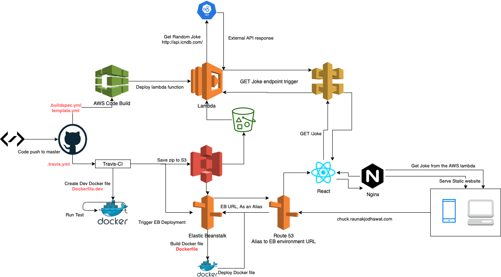

# Tech Stack
Website: www.chuck.raunakjodhawat.com

This project contains source code and supporting files for the serverless application that is created in the AWS Lambda console. Any commits, changes the code structure in AWS. and also deploys the container using AWS EB

This project includes the following files and folders:

- src - Code for the application's Lambda function.
- template.yml - A SAM template that defines the application's AWS resources.
- buildspec.yml -  A build specification file that tells AWS CodeBuild how to create a deployment package for the function.
- travis.yml - travis-ci deployment config file

##  
